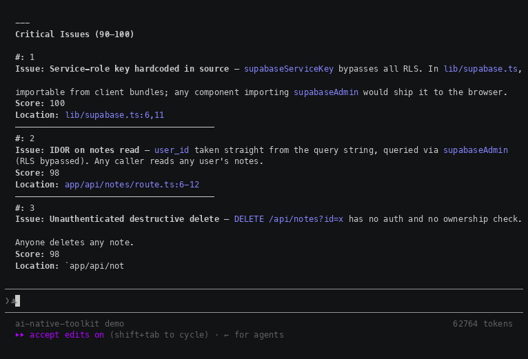

# AI Native Toolkit

> Open-source plugins that turn vibe-coding into production-grade AI-native engineering.
> Built for Claude Code; most plugins are runtime-agnostic and work in opencode too.



*One command on a deliberately vulnerable Next.js app: 14 findings, each scored and
pinned to a file and line — hardcoded service-role key, IDOR, mass assignment,
stored XSS, wildcard CORS. Unedited run of `/team-review:team-review full --no-fix`, sped up.*

## Why

An agent will happily write code that works and ships a service-role key with it.
These plugins add the parts a coding agent does not do on its own:

- **Find what review misses.** `team-review` and `pentest` go after the classes a
  single pass skips — IDOR, mass assignment, privilege escalation, unsafe cookies —
  and report severity with file and line, not vibes.
- **Keep context across sessions.** `ctx` puts project rules where every agent
  reads them; `context-handoff` survives `/compact` and `/clear`; `gh-issues`
  turns GitHub Issues into session memory.
- **Ask before building.** `deep-interview` clarifies a vague task into a brief
  instead of guessing, and `infocompressor` turns long documents into specs an
  agent can actually hold.

## Quick Start

### Claude Code

```bash
/plugin marketplace add OXI-717/ai-native-toolkit
/plugin install ctx@ai-native-toolkit
```

### opencode

There is no marketplace install for opencode. Clone the repo and point `skills.paths`
at the plugins you want — skills are picked up recursively:

```bash
git clone https://github.com/OXI-717/ai-native-toolkit.git ~/ai-native-toolkit
```

```jsonc
// ~/.config/opencode/opencode.json
{
  "skills": {
    "paths": [
      "~/ai-native-toolkit/plugins/team-review",
      "~/ai-native-toolkit/plugins/pentest",
      "~/ai-native-toolkit/plugins/gh-issues",
      "~/ai-native-toolkit/plugins/infocompressor",
      "~/ai-native-toolkit/plugins/deep-interview",
      "~/ai-native-toolkit/plugins/ctx"
    ]
  }
}
```

Restart opencode afterwards. Plugins not listed above depend on Claude Code hooks
and will not work — see [Runtime support](#runtime-support).

## Plugins

<!-- PLUGINS:BEGIN -->
| Plugin | What it does |
|--------|-------------|
| ctx | Project context: AGENTS.md, rules, init, lint |
| pentest | Black-box security audit (L0-L3) |
| context-handoff | Preserve context across /compact and /clear |
| statusline | Claude Code status bar with usage limits |
| gh-issues | GitHub Issues as AI session memory |
| infocompressor | Dense reference specs from long documents |
| deep-interview | Clarify vague tasks before planning |
| screencast | Screencast demo videos of web-app flows |
| agent-teams | Multi-agent team coordination |
| notebooklm | Source-grounded answers from NotebookLM |
| cc-analytics | Claude Code usage analytics |
| openrouter-setup | OpenRouter as an OpenAI-compatible endpoint |
| security | Security hardening audit checklist |
| team-review | Multi-agent code review with confidence filtering |
| research-ensemble | Multi-agent adversarial research reports |
| context-runbooks | Bootstrap runbooks for AGENTS.md, rules, memory, delegation, and PR flow |
<!-- PLUGINS:END -->

## Runtime support

Claude Code is the reference runtime: everything works there. opencode loads skills
from `skills.paths` but does **not** execute plugin hooks, so anything whose value
comes from lifecycle hooks degrades or stops working.

| Plugin | Claude Code | opencode | Note |
|--------|-------------|----------|------|
| team-review | full | full | Skill plus `gh` CLI, no runtime-specific APIs |
| pentest | full | full | Recon needs a Playwright MCP server, configured separately |
| gh-issues | full | full | `gh` CLI and plain files only |
| infocompressor | full | full | Pure skill |
| deep-interview | full | full | Pure skill |
| ctx | full | partial | `ctx-init` and `ctx-lint` work; auto-loading AGENTS.md and rules needs a SessionStart hook |
| context-handoff | full | manual | Save/load via the skill still works; auto-restore across sessions needs hooks |
| statusline | full | no | Reads Claude Code status-bar config and usage data; no equivalent source in opencode |

`ctx` in this repo is the public edition: `ctx-init` and `ctx-lint` only. The vault,
meetings, people and research skills depend on private infrastructure and are not
exported.

## 4 Levels of AI-Native Development

**Level 1: Vibe Coding** — ask ChatGPT, paste code, hope it works

**Level 2: Context & Rules** → `ctx`, `context-handoff`, `infocompressor`, `deep-interview` — AI keeps your project and the task itself in focus between sessions

**Level 3: Verified Development** → `team-review`, `pentest` — AI reviews and audits your code

**Level 4: Autonomous Agents** → `gh-issues`, `statusline` — session state and visibility for long autonomous runs (`statusline` is Claude Code only)

## License

MIT
