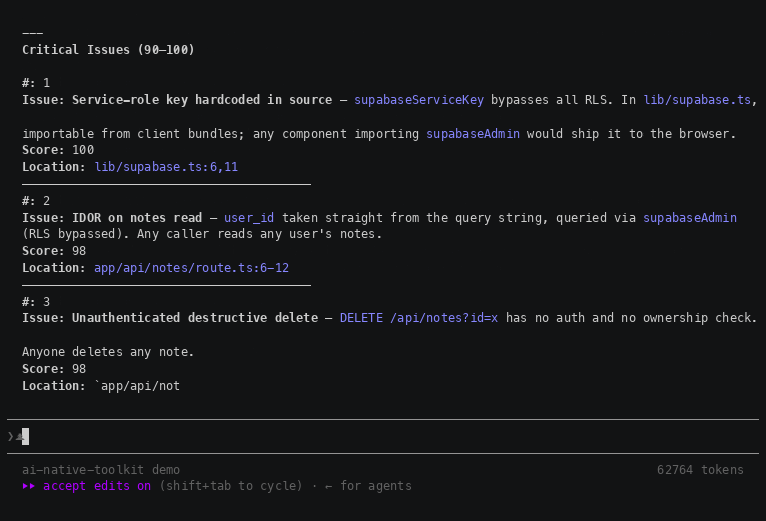

# AI Native Toolkit

> Open-source plugins that turn vibe-coding into production-grade AI-native engineering.
> Claude Code and Codex marketplaces, with selected skills checked in seven agent CLIs.



*One command on a deliberately vulnerable Next.js app: 14 findings, each scored and
pinned to a file and line — hardcoded service-role key, IDOR, mass assignment,
stored XSS, wildcard CORS. Unedited run of `/team-review:team-review full --no-fix`, sped up.*

## Why

An agent will happily write code that works and ships a service-role key with it.
These plugins add the parts a coding agent does not do on its own:

- **Find what review misses.** `team-review` and `pentest` go after the classes a
  single pass skips — IDOR, mass assignment, privilege escalation, unsafe cookies —
  and report severity with file and line, not vibes.
- **Keep context across sessions.** `ctx` puts project rules where every agent
  reads them; `context-handoff` survives `/compact` and `/clear`; `gh-issues`
  turns GitHub Issues into session memory.
- **Ask before building.** `deep-interview` clarifies a vague task into a brief
  instead of guessing, and `infocompressor` turns long documents into specs an
  agent can actually hold.

## Quick Start

### Claude Code

```bash
/plugin marketplace add OXI-717/ai-native-toolkit
/plugin install ctx@ai-native-toolkit
```

### Codex

With Codex CLI 0.157.0 or a compatible version:

```bash
codex plugin marketplace add OXI-717/ai-native-toolkit
codex plugin add ctx@ai-native-toolkit
```

The Codex marketplace contains 13 plugins. Installation does not imply support
for Claude-specific hooks, commands or status-bar features.

### OpenCode

There is no marketplace install for opencode. Clone the repo and point `skills.paths`
at the plugins you want — skills are picked up recursively:

```bash
git clone https://github.com/OXI-717/ai-native-toolkit.git ~/ai-native-toolkit
```

```jsonc
// ~/.config/opencode/opencode.json
{
  "skills": {
    "paths": [
      "~/ai-native-toolkit/plugins/pentest",
      "~/ai-native-toolkit/plugins/gh-issues",
      "~/ai-native-toolkit/plugins/infocompressor",
      "~/ai-native-toolkit/plugins/deep-interview",
      "~/ai-native-toolkit/plugins/ctx"
    ]
  }
}
```

Restart OpenCode afterwards. Native skill discovery and content checks passed for
the five packages listed above. This does not verify their external tools or
complete workflows. `team-review` is excluded from this route because its skill
uses plugin-root expansion that the adapter does not provide.

## Plugins

<!-- PLUGINS:BEGIN -->
| Plugin | What it does |
|--------|-------------|
| ctx | Project context: AGENTS.md, rules, init, lint |
| pentest | Black-box security audit (L0-L3) |
| context-handoff | Preserve context across /compact and /clear |
| statusline | Claude Code status bar with usage limits |
| gh-issues | GitHub Issues as AI session memory |
| infocompressor | Dense reference specs from long documents |
| deep-interview | Clarify vague tasks before planning |
| screencast | Screencast demo videos of web-app flows |
| agent-teams | Multi-agent team coordination |
| notebooklm | Source-grounded answers from NotebookLM |
| cc-analytics | Claude Code usage analytics |
| openrouter-setup | OpenRouter as an OpenAI-compatible endpoint |
| security | Security hardening audit checklist |
| team-review | Multi-agent code review with confidence filtering |
| research-ensemble | Multi-agent adversarial research reports |
| context-runbooks | Bootstrap runbooks for AGENTS.md, rules, memory, delegation, and PR flow |
| agent-time | Local physical work, AI engagement, and autonomous agent time |
| seo-observer | Evidence-first SEO snapshots, comparisons, outcomes, and competitor intelligence |
| seo-hub | Read-only SEO hub CLI over existing OpenSEO/Elmo/Observer evidence |
<!-- PLUGINS:END -->

For SEO setup, start with [seo-observer](plugins/seo-observer/README.md), then
[seo-hub](plugins/seo-hub/README.md). Install both plugins from the marketplace
and install each CLI separately with `uv tool install --force
<installed-plugin-root>/cli`. Plugin versions and their Python CLI package
versions are versioned independently; check `seo-hub --version` /
`seo-observer --version` for the installed CLI release.


## Runtime support

Compatibility is measured per package and surface. Marketplace installation,
reading a skill, and completing its workflow are different checks.

| Client | Checked surface | Evidence and limits |
|--------|-----------------|---------------------|
| Claude Code | Native marketplace; skill invocation/read | 19 marketplace packages installed; `infocompressor` registered, invoked and read in CLI 2.1.282 |
| Codex | Native marketplace; skill read | 13 packages installed with matching source bytes; native update checked for `ctx` and `seo-observer`; `infocompressor` read in CLI 0.157.0 |
| OpenCode | Native skill discovery | `infocompressor`, `pentest`, `gh-issues`, `deep-interview`, `ctx`: exact skill paths and content checked in 1.18.31 |
| Cursor CLI | Skill read | `infocompressor` fully read from project skills in 2026.09.26-dd393fe; IDE not checked |
| Gemini CLI | Native workspace skill install/list/uninstall | `infocompressor` checked in 0.61.0; older 0.8.1 lacks this interface |
| GitHub Copilot CLI | Native project skill install/list | `infocompressor` native skill bytes and removal checked in 1.0.88; IDE not checked |
| Pi | Native skill discovery through RPC | `infocompressor` path and removal checked in 0.73.1; renamed npm package installation not checked |

These checks cover installation and loading of skills. They do not certify all
plugins in every client, complete workflows, hooks, MCP or external services.
`statusline` uses Claude Code-specific configuration. Other clients need their
own integration for hook-driven behavior. Direct API use requires a chosen
host application: an API endpoint has no universal plugin installation command.

`ctx` in this repo is the public edition: `ctx-init` and `ctx-lint` only. The vault,
meetings, people and research skills depend on private infrastructure and are not
exported. The additional `ctx-lint fleet` subcommand is unsupported in this
public edition: it depends on a private rule-audit module and BB inventory.

## 4 Levels of AI-Native Development

**Level 1: Vibe Coding** — ask ChatGPT, paste code, hope it works

**Level 2: Context & Rules** → `ctx`, `context-handoff`, `infocompressor`, `deep-interview` — AI keeps your project and the task itself in focus between sessions

**Level 3: Verified Development** → `team-review`, `pentest` — AI reviews and audits your code

**Level 4: Autonomous Agents** → `gh-issues`, `statusline` — session state and visibility for long autonomous runs (`statusline` is Claude Code only)

## License

MIT
