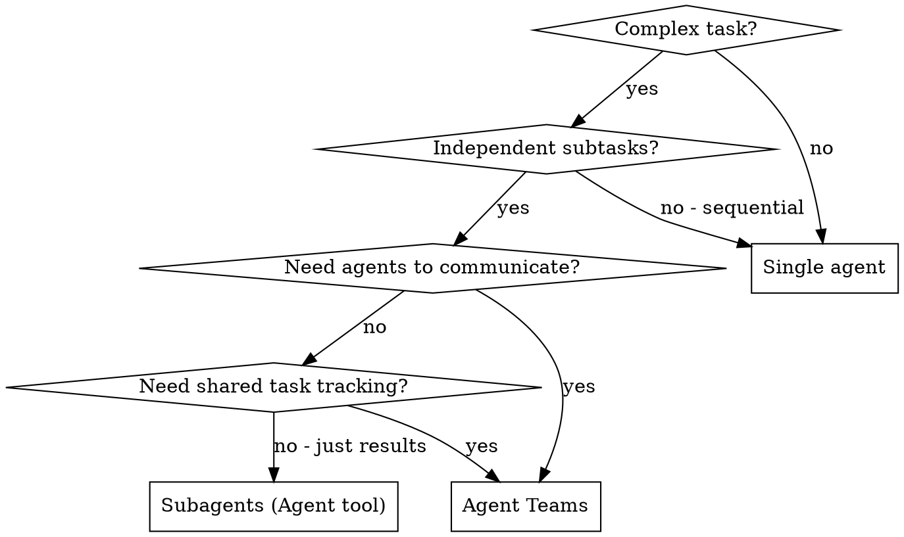

# Agent Teams

Coordinate multiple autonomous agents working on a shared task list with direct messaging.

**Core principle:** Teams for collaboration with shared state. Subagents for focused tasks returning results. Don't use teams when subagents suffice.

## When to Use



**Use teams:**
- Cross-layer work (frontend + backend + tests) needing coordination
- Research with multiple competing hypotheses sharing findings
- PR review with parallel security/performance/tests reviewers
- Large refactoring where agents own separate modules but must align

**Use subagents instead:**
- Focused tasks where you only need the result
- No inter-agent communication needed
- Simple parallel dispatch (use `dispatching-parallel-agents`)

## Teams vs Subagents

| Aspect | Subagents (plain `Agent`) | Agent Teams (named `Agent` + shared tasks) |
|--------|-------------------|------------------------|
| Context | Own, returns summary | Own, fully independent |
| Communication | Only back to caller | Agents message each other |
| Coordination | Caller manages all | Shared task list + self-coordination |
| Cost | Lower (summarized results) | Higher (each agent = separate Claude) |
| File conflicts | Caller integrates | Risk if agents edit same files |
| Best for | Focused tasks, results matter | Collaboration, discussion matters |

## Lifecycle

### 1. The team already exists

There is no team-creation step and no `Teammate` tool. Every session has **one implicit
team**: the first spawned agent joins it, the main conversation is its lead.

The runtime keeps the registry itself, keyed by session, not by a team name you choose:

- `~/.claude/teams/session-<id>/config.json` — members (lead + teammates)
- `~/.claude/teams/session-<id>/inboxes/<agent-name>.json` — per-agent mailbox

The shared task list lives in the session, not in a project directory — nothing is
written under `.task-runner/`.

### 2. Create Tasks

```
TaskCreate(subject="Implement JWT middleware", description="...", activeForm="Implementing JWT middleware")
TaskCreate(subject="Write auth API tests", description="...", activeForm="Writing auth tests")
```

### 3. Spawn Teammates

Use the `Agent` tool with `name` — the name is what makes the agent addressable later.
Do **not** pass `team_name`: it is deprecated and ignored (one implicit team per session).

```
Agent(
    subagent_type="general-purpose",
    name="backend-dev",
    prompt="You are a backend developer. Check TaskList for your assignments."
)
Agent(
    subagent_type="general-purpose",
    name="test-writer",
    prompt="You are a test specialist. Check TaskList for your assignments."
)
```

### 4. Assign Tasks

```
TaskUpdate(taskId="1", owner="backend-dev")
TaskUpdate(taskId="2", owner="test-writer")
```

### 5. Monitor & Communicate

`SendMessage` takes `to` / `message` / `summary`. There is no `type` field for ordinary
messages and no broadcast — address teammates one by one.

```
SendMessage(to="backend-dev", message="Use httpOnly cookies for tokens", summary="JWT storage guidance")
```

Teammates auto-notify you when idle (turn ended). This is normal — idle means waiting, not done.

### 6. Shutdown

Teammates do not exit automatically when idle; they remain resident in the session waiting for messages. Once team work is complete or a teammate is genuinely no longer needed, send a `shutdown_request` to stop them:

```
SendMessage(to="backend-dev", message={"type": "shutdown_request", "reason": "Work complete"}, summary="stop backend-dev")
```

Shutting teammates down is the **lead's** call. A teammate never originates a
`shutdown_request` on its own — it only answers one with `shutdown_response`
(echo the `request_id`, set `approve`). Approving ends that teammate's process.

## Best Practices

### Task Sizing

- 5-6 tasks per teammate is optimal
- Too small → coordination overhead > value
- Too large → no checkpoints, hard to monitor
- Each task should have clear deliverable (file, function, test suite)

### Prevent File Conflicts

Two agents editing same file = overwrites. Partition by ownership:

```
backend-dev  → src/auth/middleware.ts, src/auth/jwt.ts
test-writer  → tests/auth/*.test.ts
```

**If overlap unavoidable:** sequence the tasks with `addBlockedBy`.

### Context for Teammates

Teammates DON'T inherit your conversation history. They get:
- CLAUDE.md + rules
- MCP servers, skills
- Your spawn prompt

**Make spawn prompts rich:**

```
❌ "Fix the auth bug"
✅ "Fix JWT expiry bug in src/auth/jwt.ts. Token refresh fails when
    access token expires but refresh token is valid. Error: 'TokenExpiredError'
    at line 42. The refresh logic in refreshAccessToken() doesn't check
    refresh token validity before attempting renewal. Write tests first."
```

### Communication Patterns

**Lead → Teammate:** Direct message with context
```
SendMessage(to="backend-dev",
    message="The DB schema changed - users table now has 'role' column",
    summary="Schema change notification")
```

**Teammate → Lead:** address the main conversation as `main` (background teammates only —
a foreground agent returns its result to the caller instead)
```
SendMessage(to="main", message="Middleware done, tests green", summary="JWT middleware ready")
```

**No broadcast.** To reach everyone, send the same message to each teammate by name —
which is a good reason to keep teams at 2-4 agents.

**Plan approval:** Spawn teammate in plan mode, review their plan before they implement.

### Idle State

Teammates go idle after every turn. This is **normal behavior**, not an error:
- Idle = waiting for input
- Sending a message wakes them up
- Don't react to idle notifications unless assigning new work

## Common Mistakes

| Mistake | Fix |
|---------|-----|
| Using teams for sequential work | Use single agent or subagents |
| Not partitioning files by agent | Assign file ownership explicitly |
| Sparse spawn prompts | Include full context, don't assume shared history |
| Messaging everyone about routine progress | Mark it with `TaskUpdate` — teammates read the list themselves |
| Reacting to every idle notification | Idle is normal, only respond when needed |
| Expecting to read results off the task list | Resolved tasks vanish — require a `SendMessage` report |
| Starting code before teammates finish | Wait for results, verify, then integrate |
| Too many teammates | 2-4 optimal, more = coordination overhead |

## Anti-Patterns

**Pipeline anti-pattern:** Don't split sequential phases into separate agents (planning → implementation → testing). One agent doing all three is cheaper and avoids handoff loss.

**Manager-only lead:** Don't just coordinate — the lead agent should also do work. Delegate mode is for complex orchestration only.

**Over-communication:** Don't message every teammate with status updates. Use TaskUpdate to mark progress — teammates check TaskList themselves.

## Quick Reference

| Tool | Purpose |
|------|---------|
| `Agent(subagent_type=..., name=...)` | Spawn teammate (no `team_name` — deprecated) |
| `TaskCreate` / `TaskList` / `TaskGet` / `TaskUpdate` | Manage shared tasks |
| `SendMessage(to=..., message=..., summary=...)` | Message a teammate, or `to="main"` for the lead |
| `SendMessage(to=..., message={"type": "shutdown_request"})` | Shut down a teammate when no longer needed |

Gone in the current runtime: the `Teammate` tool (both `spawnTeam` and `cleanup`), the
`team_name` argument, `type="message"` / `type="broadcast"` and `recipient=` / `content=`.

## Limitations (Current)

- No `/resume` for in-process teammates
- One team per session
- No nested teams (teammates can't create sub-teams)
- Lead is fixed for lifecycle
- Split panes need tmux/iTerm2 (not VS Code terminal)
- Task status may lag — teammates sometimes forget to mark `completed`
- A resolved task disappears: once it is `completed` it drops out of `TaskList` **and**
  `TaskGet` answers "Task not found". Deleted tasks vanish the same way, so the list can't
  tell you whether work was finished or thrown away — ask the teammate, or have it report
  the result via `SendMessage` before resolving. Keep your own record if you need history:
  IDs keep counting up, so a gap means a task existed and is gone.
